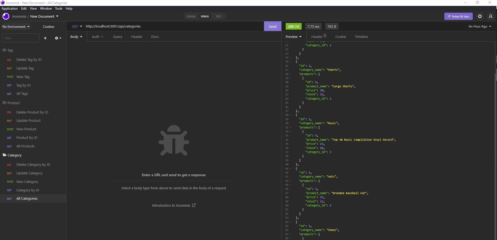
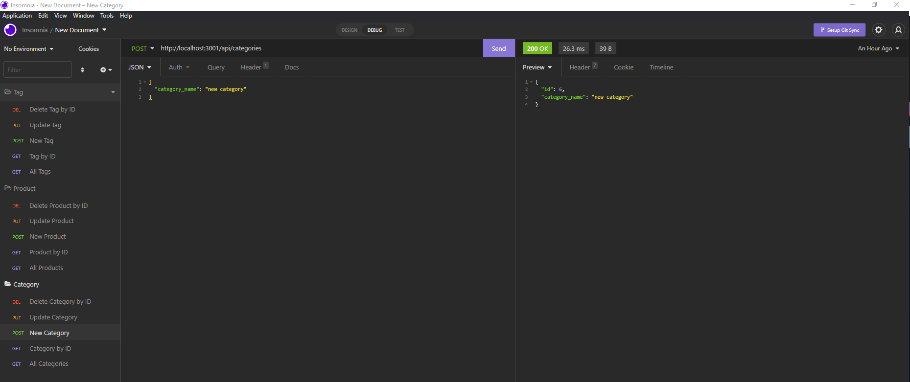

# ORM_ECommerceBackEnd

## Description
```
For this homework assignment we are asked to modify starter code to build the back-end of an e-commerce site.
``` 

Acceptance Criteria:

```
GIVEN a functional Express.js API
WHEN I add my database name, MySQL username, and MySQL password to an environment variable file
THEN I am able to connect to a database using Sequelize
WHEN I enter schema and seed commands
THEN a development database is created and is seeded with test data
WHEN I enter the command to invoke the application
THEN my server is started and the Sequelize models are synced to the MySQL database
WHEN I open API GET routes in Insomnia Core for categories, products, or tags
THEN the data for each of these routes is displayed in a formatted JSON
WHEN I test API POST, PUT, and DELETE routes in Insomnia Core
THEN I am able to successfully create, update, and delete data in my database
```

## Screenshots:
Video of how application works
> https://drive.google.com/file/d/1CCtETAW6RmfzXzjen4MnMFBvpPNcnBZc/view?usp=sharing


A look at route interaction through Insomnia:





##  Installation
  Instruction for installing and running project:
  * Open the env file and change the username and password for SQL
  * Open the terminal and run 'npm install'
  * After installing the needed node modules, run 'node server.js'
  * Once you have confirmation that the port is listening, open insomnia
  * Use insomnia for interacting


## Link to gitHub Repository:
>  https://github.com/autumnlf/ORM_ECommerceBackEnd